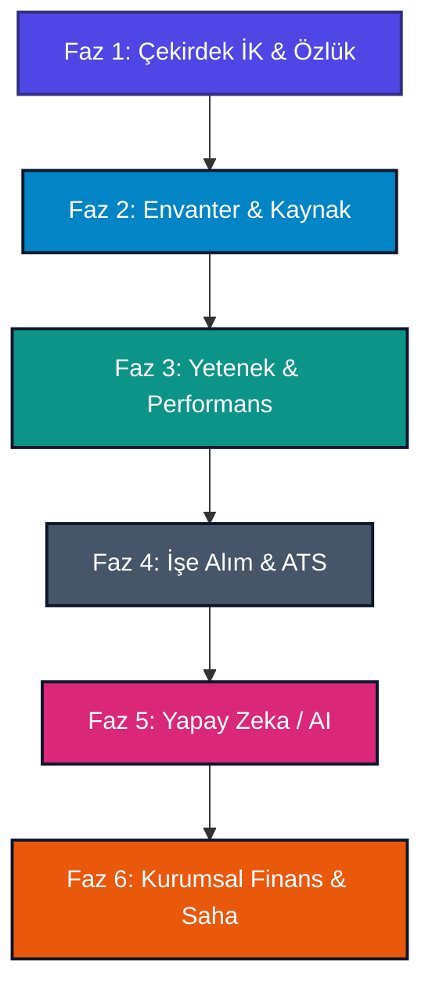

# SeedHR - Fazlandırılmış Kapsamlı Modül Yol Haritası

SeedHR, kurumsal şirketlerin insan kaynakları süreçlerini uçtan uca dijitalleştirmek, otomatikleştirmek ve yapay zeka ile optimize etmek üzere tasarlanmış modern bir **HRMS (İnsan Kaynakları Yönetim Sistemi)** uygulamasıdır. 

Uygulamanın mevcut özellikleri ile gelecekte eklenecek tüm modülleri ticari öncelik, teknik bağımlılıklar ve uygulanabilirlik açısından **6 ana faza** bölünmüştür.

---

## 📈 Fazlandırılmış Genel Yol Haritası

| Faz | Kapsam | Durum | Zamanlama / Hedef |
| :--- | :--- | :---: | :--- |
| **FAZ 1** | **Çekirdek İK ve Özlük Modülleri** | 🟡 Kısmen | Mevcut + Hafta 3-4 (Onboarding) |
| **FAZ 2** | **Envanter ve Kaynak Yönetimi** | ⏳ Planlandı | Hafta 1-2 (Zimmet Modülü) |
| **FAZ 3** | **Yetenek ve Gelişim Yönetimi** | ⏳ Planlandı | Hafta 5-8 (Performans & LMS) |
| **FAZ 4** | **Gelişmiş ATS ve Organizasyon Yapısı**| 🟡 Kısmen | Mevcut + Hafta 9-11 (Org & Referans) |
| **FAZ 5** | **Yapay Zeka (AI) Destekli İK** | ⏳ Planlandı | Hafta 11-12+ (Parsing, Matching, Chatbot)|
| **FAZ 6** | **Kurumsal Finansal ve Saha Modülleri**| ➕ Genişleme | İleri Aşama (Payroll, Expense, Vardiya) |

---

## 📂 Faz Detayları ve Teknik Kapsamı

### FAZ 1: Çekirdek İK ve Özlük Modülleri
*Şirketlerin temel İK süreçlerini yönettiği, dijital özlük dosyalarını barındıran temel fazdır.*

*   **Personel Yönetimi (Mevcut - ✅):** Çalışan profili, kişisel, iletişim, adres, acil durum rehberi ve yönetici-ast hiyerarşisi takipleri.
*   **Departman & Pozisyon Yönetimi (Mevcut - ✅):** Departman kodları, alt departmanlar ve pozisyon unvan tanımlamaları.
*   **İzin Yönetimi (Mevcut - ✅):** Yıllık, hastalık, mazeret izin türleri; talep oluşturma, yönetici onay akışı ve dinamik kalan gün hakediş takibi.
*   **Devamsızlık & Giriş-Çıkış (Mevcut - ✅):** Günlük Check-in / Check-out, mesai saatleri hesaplama, geç kalma ve devamsızlık raporları.
*   **Doküman Yönetimi (Mevcut - ✅):** İşe giriş evrakları, KVKK formları ve çalışan sertifikalarının güvenli yüklenip saklanması.
*   **Duyurular & Şirket İçi İletişim (Mevcut - ✅):** Şirket genel duyuruları, kutlama ve etkinlik yönetim sistemi.
*   **Onboarding / İşe Alım Uyum Süreci (Planlandı - ⏳ - Hafta 3-4):**
    *   Yeni başlayanlar için pozisyon/departman bazlı görev şablonları.
    *   IK, IT, Yönetici ve Çalışan arasında görev dağılımı ve checklist.
    *   Hangfire ile otomatik hatırlatma (e-posta) bildirimleri.
    *   Süreci tamamlayan çalışanlar için otomatik tamamlama belgesi dökümü.

---

### FAZ 2: Envanter ve Kaynak Yönetimi (Hafta 1-2)
*Şirketlerin demirbaş kaynaklarını ve bunlara ait hukuki/operasyonel süreçleri yöneterek hızlı gelir (add-on) ürettiği fazdır.*

*   **Zimmet Yönetimi (Asset Management) (Planlandı - ⏳):**
    *   **Varlık Envanteri:** Bilgisayar, telefon, monitör, lisans vb. demirbaşların seri no, marka, model ve alış fiyatı ile listelenmesi.
    *   **Atama ve İade:** Boştaki cihazların çalışanlara teslimi ve geri iade alınma durumu takipleri (Yeni, İyi, Hasarlı vb.).
    *   **Dijital Zimmet Teslim Formu (PDF):** Teslim anında çalışan tarafından imzalanabilen barkodlu dijital teslim tutanağı.
    *   **Amortisman Hesaplama & Rapor:** Demirbaş yıpranma oranları ve departman bazlı envanter maliyet raporu.

---

### FAZ 3: Yetenek ve Gelişim Yönetimi (Hafta 5-8)
*Çalışanların verimliliğini ölçen, eğitim ve kariyer hedeflerini yöneten gelişim fazıdır.*

*   **360 Derece Performans Değerlendirme (Planlandı - ⏳ - Hafta 5-6):**
    *   Çoklu değerlendirici mimarisi (Kendi, Yöneticisi, Çalışma Arkadaşları ve Astları).
    *   Farklı departmanlara özel yetkinlik formları ve puan ağırlıkları (Scoring Rubrics) tanımlama sihirbazı.
    *   Değerlendirme süreçlerinin durum kontrolü (Taslak, Gönderildi, İmzalandı).
*   **Eğitim Yönetimi (LMS) (Planlandı - ⏳ - Hafta 7-8):**
    *   Online veya sınıf içi eğitim kataloğunun yönetimi.
    *   Zorunlu İSG/Siber Güvenlik gibi eğitimlerin atanması ve çalışan tamamlama oranlarının takibi.
    *   Süreli sertifikaların takibi ve yenileme tarihlerinden önce İK/çalışan uyarı sistemi.

---

### FAZ 4: Gelişmiş ATS ve Organizasyon Yapısı (Hafta 9-11)
*Aday alım süreçlerini profesyonelleştiren ve şirket organizasyon yapısını görselleştiren fazdır.*

*   **İşe Alım & ATS (Mevcut - ✅):** Pozisyon açma, CV havuzu oluşturma, mülakat planlama ve aday aşamaları yönetimi.
*   **Aday Kariyer Portalı (Mevcut - ✅):** Dışarıya açık kariyer sayfasında ilanların listelenmesi ve adayların başvuru yapabilmesi.
*   **Organizasyon Şeması Görselleştirme (Planlandı - ⏳ - Hafta 9-10):**
    *   Çalışan yönetici ilişkilerine göre çizilen dinamik, tıklanabilir hiyerarşi ağacı.
    *   Farklı şube, fabrika ve ofis konumlarının tanımlanıp çalışanların lokasyon bazlı gruplanması.
*   **Referans Kontrolü (Background Check) (Planlandı - ⏳ - Hafta 10-11):**
    *   Adayların geçmiş yöneticilerinin iletişim bilgileri üzerinden otomatik değerlendirme formu gönderimi ve analizlerin aday kartında saklanması.

---

### FAZ 5: Yapay Zeka (AI) Destekli İK (Hafta 11-12+)
*Doğal dil işleme (NLP) ve LLM teknolojileriyle operasyonları hızlandırıp akıllı hale getiren yenilikçi fazdır.*

*   **AI CV Analizi (CV Parsing) (Planlandı - ⏳):** PDF/Word CV'lerin otomatik taranıp eğitim, deneyim, yetenek ve dil verilerinin çıkarılarak kaydedilmesi.
*   **AI Aday Eşleştirme (Smart Matching) (Planlandı - ⏳):** Pozisyon ilanındaki aranan şartlara göre havuzdaki en uyumlu adayların yapay zeka ile puanlanıp sıralanması.
*   **AI Mülakat Asistanı (Planlandı - ⏳):** Pozisyona özel akıllı mülakat soruları önerme ve mülakat notları/ses dökümlerinden aday özet raporu üretme.
*   **AI HR Asistanı (RAG Chatbot) (Planlandı - ⏳):** Çalışanların izin hakedişleri, şirket yönetmelikleri veya politikalarına dair sorularını anında cevaplayan kurumsal yapay zeka robotu.

---

### FAZ 6: Kurumsal Finansal ve Saha Modülleri (Genişleme Paketi)
*İleri aşamada büyük işletmelerin ihtiyaçlarını karşılayacak finans ve vardiya entegrasyonu sağlayan genişleme fazıdır.*

*   **Bordro ve Maaş Yönetimi (Payroll) (Genişleme - ➕):** Net/brüt maaş, ek mesai, prim, vergi kesintisi hesaplama ve e-bordro dökümleri oluşturma.
*   **Masraf ve Avans Yönetimi (Genişleme - ➕):** Harcama faturalarının sisteme yüklenmesi, onay akışı ve muhasebe entegrasyonu.
*   **Vardiya ve Puantaj Yönetimi (Genişleme - ➕):** Vardiya planlama, çalışma saatleri puantajı hesaplama ve maaş modülüne veri aktarımı.
*   **Ziyaretçi Yönetimi (Visitor) (Genişleme - ➕):** Ofise gelen misafirlerin kayıt altına alınması ve ilgili personele ziyaretçi bildirimi iletilmesi.

---

## 🛠️ Teknik Standartlar ve Mimari
1.  **Modülerlik:** Her modül için backend tarafında bağımsız Repository, Service ve Controller sınıfları yazılacaktır.
2.  **Veri Esnekliği:** Onboarding görev şablonları ve performans formları için MongoDB'nin esnek doküman yapısı (JSON Schema) kullanılacaktır.
3.  **Çift Modlu Çalışma (Mock & Real):** Next.js tarafında `lib/api.ts` içerisinde mock veri altyapısı kurulacak, böylece çevrimdışı / demo ortamlarında da tam işlevli çalışabilecektir.
